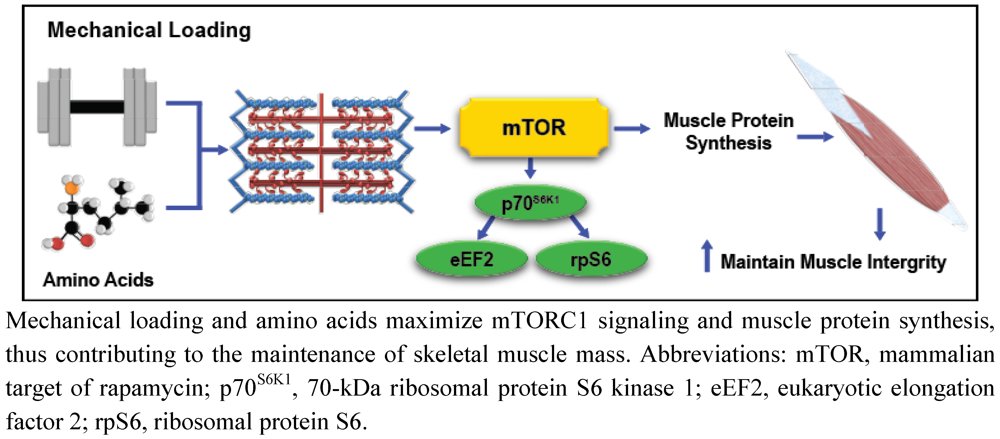
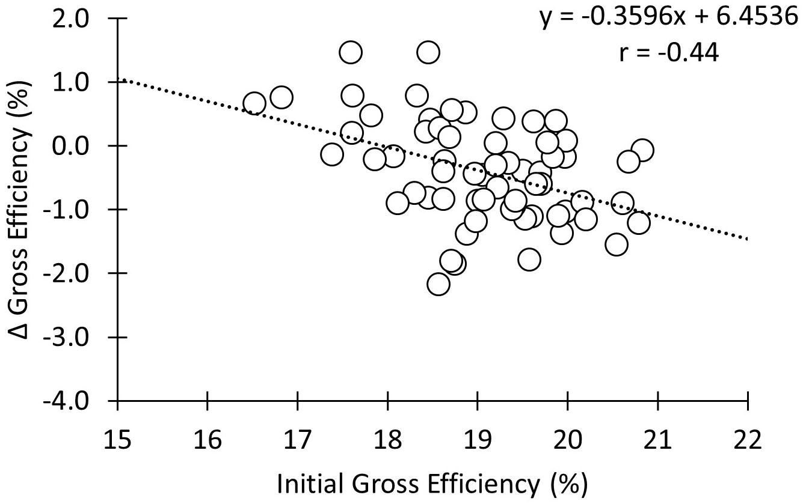

```{r setup, include=FALSE}
knitr::opts_chunk$set(echo = FALSE, warning= FALSE, message=FALSE)
```

# Issues in studies of association

* Influential data points
* Correlation does not imply causation
* Regression towards the mean


# Influential data points -- mTOR signaling and exercise induced muscle hypertrophy

```{r echo=FALSE, out.width='100%', fig.align='center'}

```

\tiny
Pasiakos, S. M. (2012). "Exercise and Amino Acid Anabolic Cell Signaling and the Regulation of Skeletal Muscle Mass." Nutrients 4(7).
\normalsize

# Exercise induced P70 S6-kinase phosphorylation predicts muscle hypertrophy (Mitchell et al. 2013)

```{r mitchell, fig.align='center',fig.dim = c(4,2.5)}

library(tidyverse); library(readxl)

s <- read_excel("./data/Mitchell2013.xlsx") %>%
        summarise(iqr = IQR(p70),
                  q1 = quantile(p70, 0.25), 
                  q3 = quantile(p70, 0.75),
                  upper.bound = q3 + iqr*1.5, 
                  lower.bound = q1 - iqr*1.5,
                  iqr.csa = IQR(CSA),
                  q1.csa = quantile(CSA, 0.25), 
                  q3.csa = quantile(CSA, 0.75),
                  upper.bound.csa = q3.csa + iqr.csa*1.5, 
                  lower.bound.csa = q1.csa - iqr.csa*1.5) 

read_excel("./data/Mitchell2013.xlsx") %>%
        ggplot(aes(p70, CSA)) + geom_point(size = 2, alpha = 0.6, shape = 21, fill = "#E69F00") +
     #  geom_vline(xintercept = s$upper.bound) +
     #  geom_vline(xintercept = s$lower.bound) +
     #  geom_hline(yintercept = s$upper.bound.csa) +
     #  geom_hline(yintercept = s$lower.bound.csa) +
     #   annotate("text", x = 3, y = s$upper.bound.csa + 3, label = "Q3 + 1.5 IQR", size = 3) +
     #   annotate("text", x = 3, y = s$lower.bound.csa + 3, label = "Q1 - 1.5 IQR", size = 3) +
     #   annotate("text", x = s$upper.bound+0.1, y = 25, label = "Q3 + 1.5 IQR", angle = 90, size = 3) +
     #   annotate("text", x = s$lower.bound+0.1, y = 25, label = "Q1 - 1.5 IQR", angle = 90, size = 3) +
        theme_classic() +
       geom_smooth(method = "lm", color = "#999999", fill = "#E69F00")

```

\tiny
Mitchell, C. J., et al. (2013). "Muscular and Systemic Correlates of Resistance Training-Induced Muscle Hypertrophy." PLoS One 8(10): e78636.
\normalsize

# Influential data points

* Data points that substantially deviates from the rest of the data may affect the interpretation of regression models.
* "Leverage" is the effect each data point has on the model, unusual X-values produces larger leverage
* This can be assessed by looking at the graph, and numerically
* A tool in simple regression would be to assess outliers (in the X-axis) on model characteristics

# Detect outliers

* An outlier is defined as $Q3/Q1 \pm 1.5 \times IQR$

```{r mitchell-fig2, fig.align='center',fig.dim = c(4,2.5)}
library(tidyverse); library(readxl)

s <- read_excel("./data/Mitchell2013.xlsx") %>%
        summarise(iqr = IQR(p70),
                  q1 = quantile(p70, 0.25), 
                  q3 = quantile(p70, 0.75),
                  upper.bound = q3 + iqr*1.5, 
                  lower.bound = q1 - iqr*1.5,
                  iqr.csa = IQR(CSA),
                  q1.csa = quantile(CSA, 0.25), 
                  q3.csa = quantile(CSA, 0.75),
                  upper.bound.csa = q3.csa + iqr.csa*1.5, 
                  lower.bound.csa = q1.csa - iqr.csa*1.5) 

read_excel("./data/Mitchell2013.xlsx") %>%
        mutate(infl = if_else(p70 > s$upper.bound, "infl", "ok")) %>%
        ggplot(aes(p70, CSA, fill = infl)) + geom_point(size = 2, alpha = 0.6, shape = 21) +
       geom_vline(xintercept = s$upper.bound) +
       geom_vline(xintercept = s$lower.bound) +
       geom_hline(yintercept = s$upper.bound.csa) +
       geom_hline(yintercept = s$lower.bound.csa) +
        annotate("text", x = 3, y = s$upper.bound.csa + 3, label = "Q3 + 1.5 IQR", size = 3) +
       annotate("text", x = 3, y = s$lower.bound.csa + 3, label = "Q1 - 1.5 IQR", size = 3) +
       annotate("text", x = s$upper.bound+0.1, y = 25, label = "Q3 + 1.5 IQR", angle = 90, size = 3) +
        annotate("text", x = s$lower.bound+0.1, y = 25, label = "Q1 - 1.5 IQR", angle = 90, size = 3) +
        scale_fill_manual(values = c("#999999", "#E69F00"))+
        theme_classic() +
        theme(legend.position = "none") 
       # geom_smooth(method = "lm", color = "#999999")


```

# Re-do analysis without outlier

```{r mitchell-fig3, fig.align='center',fig.dim = c(4,2.5)}
library(tidyverse); library(readxl)


read_excel("./data/Mitchell2013.xlsx") %>%
        mutate(infl = if_else(p70 > s$upper.bound, "infl", "ok")) %>%
        ggplot(aes(p70, CSA, fill = infl)) + geom_point(size = 2, alpha = 0.6, shape = 21) +
     # geom_vline(xintercept = s$upper.bound) +
     # geom_vline(xintercept = s$lower.bound) +
     # geom_hline(yintercept = s$upper.bound.csa) +
     # geom_hline(yintercept = s$lower.bound.csa) +
     #  annotate("text", x = 3, y = s$upper.bound.csa + 3, label = "Q3 + 1.5 IQR", size = 3) +
     # annotate("text", x = 3, y = s$lower.bound.csa + 3, label = "Q1 - 1.5 IQR", size = 3) +
     # annotate("text", x = s$upper.bound+0.1, y = 25, label = "Q3 + 1.5 IQR", angle = 90, size = 3) +
     #  annotate("text", x = s$lower.bound+0.1, y = 25, label = "Q1 - 1.5 IQR", angle = 90, size = 3) +
        scale_fill_manual(values = c("#999999", "#E69F00"))+
        theme_classic() +
        theme(legend.position = "none") +
        geom_smooth(method = "lm", color = "#999999")


```

What can we conclude from the Mitchell data-set?


# Regression towards the mean

* Francis Galton analyzed parents and children heights to study heritability (how much of a trait can be explained by genetics?)
* Does parents heights determine children heights?

# Regression towards the mean

```{r galton, fig.align='center',fig.dim = c(4,2.5)}

 library(mosaicData)

data(Galton)
Galton %>%
                mutate(father = father * 2.54,
                       mother = mother * 2.54,
                       height = height * 2.54,
                       sex = factor(sex, levels = c("F", "M"), labels = c("Female", "Male"))) %>%
                gather(parent, p.height, father:mother) %>%
                ggplot(aes(height, color = sex, fill = sex)) + geom_histogram(alpha=0.5, position="dodge") +
                scale_color_manual(values=c("#999999", "#E69F00", "#56B4E9"), name = "") + 
                scale_fill_manual(values=c("#999999", "#E69F00", "#56B4E9"), name = "") +
                theme_classic() + 
        theme(axis.title = element_text(size = 10),
              axis.text = element_text(size = 10)) +
                xlab("Children heights (cm)") + ylab("Count")
```

* Do tall parents have tall children?

# Regression towards the mean

* If parents heights would predict children heights, what would the regression line look like? 

```{r galton-hypothesis, fig.align='center',fig.dim = c(4,2.5)}

df <- data.frame(x = c(140, 200), y = c(140, 200))

df %>%
        ggplot(aes(x, y)) + geom_point(color = "white") + theme_classic() + 
        xlab("Parent height (cm)") + ylab("Children height (cm)") +
        geom_segment(aes(x = 150, xend = 190, y = 150, yend = 190), color = "#999999", size = 1.5) +
        geom_segment(aes(x = 160, xend = 180, y = 150, yend = 190), color = "#E69F00", size = 1.5) +
        geom_segment(aes(x = 140, xend = 200, y = 150, yend = 190), color = "#56B4E9", size = 1.5) +
        annotate("text", x = 180, y = 194, label = "a") +
        annotate("text", x = 190, y = 194, label = "b") +
        annotate("text", x = 200, y = 194, label = "c") +
        
        annotate("text", x = 145, y = 190, label = expression(a:~~~ beta[1] > 1)) +
        annotate("text", x = 145, y = 185, label = expression(b:~~~ beta[1] == 1)) +
        annotate("text", x = 145, y = 180, label = expression(c:~~~ beta[1] < 1)) 


```

# Regression towards the mean

* Regression towards the mean predicts that upon repeated sampling from a normal distribution, extreme values will be less frequent than values close to the mean.
* An extreme value **within** a family will be "replaced" by a less extreme.
* How would the regression line look?


# Regression towards the mean

```{r, fig.align='center',fig.dim = c(4,2.5)}
Galton %>%
        mutate(father = father * 2.54,
               mother = mother * 2.54,
               height = height * 2.54) %>%
        gather(parent, p.height, father:mother) %>%
        mutate(sex = factor(sex, levels = c("F", "M"), labels = c("Female", "Male")),
               parent = factor(parent, levels = c("father", "mother"), labels = c("Father", "Mother"))) %>%
        ggplot(aes(p.height, height)) + geom_point(alpha = 0.2) +
        facet_grid(sex~parent) +
        geom_segment(aes(x = 145, xend = 200, y = 140, yend = 200), color = "#56B4E9", size = 1) +
        geom_smooth(method = "lm",  se = FALSE, color = "#E69F00", size = 1) + 
        scale_x_continuous(limits = c(140, 210)) +
        scale_y_continuous(limits = c(140, 210)) +
        theme_classic() +
        xlab("Parent height (cm)") + ylab("Children height (cm)")

```

# Regression towards the mean

* This poses a problem when analyzing baseline characteristics and change due to training 
```{r echo=FALSE, out.width='70%', fig.align='center'}

```


When using a correction "*...to minimize the effect* [of regression to the mean], *the correlations in the present study were weakened.*"
\tiny
Skovereng, K., et al. (2018). "Effects of Initial Performance, Gross Efficiency and O~2peak~ Characteristics on Subsequent Adaptations to Endurance Training in Competitive Cyclists." Front Physiol 9(713).
\normalsize

# Multiple linear regression

* The simple linear regression model... 

$$y = \beta_0 + \beta_1X_1 + \epsilon$$

* ... can be extended to include multiple covariates (or independent variables)

$$y = \beta_0 + \beta_1X_1 + \beta_2X_2 ... \beta_pX_p + \epsilon $$

* The model can contain continuous covariates and covariates that only take $0$ and $1$, these are called *dummy variables*

# Dummy variables

* A dummy variable can be used in a regression model representing a qualitative variable (e.g. Male and Female) where the first **level** of the variable is **coded** $0$ and the second level is **coded** $1$

* In the regression model, the numerical coded variable is used, a simple uni-variate example:

```{r simple-dichotomous, fig.align='center',fig.dim = c(3.5,2)}
set.seed(1)
df <- data.frame(x = c(0,0,0,0,0,0,0,0, 1,1,1,1,1,1,1,1), y = c(rnorm(8, 140, 10), rnorm(8, 170, 10)),
                 sex = c(rep("Female",8), rep("Male", 8)))


s <- df %>%
        group_by(x) %>%
        summarise(m = mean(y))  %>%
        data.frame()


df %>%
        ggplot(aes(x, y)) + geom_point(color = "#999999") + theme_classic() + 
        scale_x_continuous(breaks = c(0,1), expand = c(0.4, 0.4)) + 
        geom_segment(x = 0, xend = 0.5, y = s[1,2], yend = s[1,2]) +
        geom_segment(x = 0.5, xend = 0.5, y = s[1,2], yend = s[2,2]) +
        geom_segment(x = 0.5, xend = 1, y = s[2,2], yend = s[2,2]) + 
        annotate("text", x = -0.5, y = s[1,2], 
                 label = paste("beta[0]==", round(s[1,2],1)), parse = TRUE) +
        annotate("text", x = 0, y = s[2,2], 
                 label = paste("beta[1]==", round(s[2,2]-s[1,2],1)), parse = TRUE) +
        annotate("text", x = -0.6, y = s[2,2]+10, 
                 label = paste("y == beta[0] + beta[1]*X[1]"), parse = TRUE)
```

# Dummy variables

* In the case of Female and Male the dummy variable for sex is coded

if $sex = Female$ then $X = 0$

if $sex = Male$ then $X = 1$

Mean values for women:

$$y = \beta_0 + \beta_1 \times 0 = \beta_0$$

Mean values for men:

$$y = \beta_0 + \beta_1 \times 1 = \beta_0 + \beta_1$$

# Dummy variables can used to code more levels than 2

* Using dummy variables, more **levels** can be coded into the model
* More parameters will have to be estimated, if three groups ($A$, $B$ and $C$) are to be included in the model, 3-1 dummy variables are needed

If $group = A$ then $X_1 = 0, X_2 = 0$

If $group = B$ then $X_1 = 1, X_2 = 0$

If $group = C$ then $X_1 = 0, X_2 = 1$

# Dummy variables can be used to control for group effects

* Simpson's paradox is when **marginal** and **partial** relationships in the data set have different signs, i.e. a positive relationship in the whole data-set and negative relationships within subgroups

```{r simpsons-paradox, fig.align='center',fig.dim = c(4,2.5)}
set.seed(1)

x <- runif(40, 10, 20)

y1 <- 1400 + (-15)*x + rnorm(40, 0, 100)

y2 <- 1840 + (-15)*x + rnorm(40, 0, 100)


df <- data.frame(x = c(x, x+5), y = c(y1, y2), Group = c(rep("G1", 40), rep("G2", 40)))


df %>%
        ggplot(aes(x, y)) + geom_point() + geom_smooth(method = "lm") + 
        geom_smooth(aes(color = Group), method = "lm") + theme_classic()

```


# Dummy variables can be used to control for group effects

```{r simpsons-paradox-regressions, results='asis'}
library(knitr)
mod1 <- lm(y ~ x, data = df)
mod2 <- lm(y ~ x + Group, data = df)


kable(coef(summary(mod1))[,c(1:3)], "latex", 
      booktabs = TRUE,
      caption = "Simple model", digits =c(2,2,2))

```

```{r simpsons-paradox-regressions2, results='asis'}

kable(coef(summary(mod2))[,c(1:3)], "latex", 
      booktabs = TRUE,
      caption = "Controlling for groups", digits =c(2,2,2))

```

