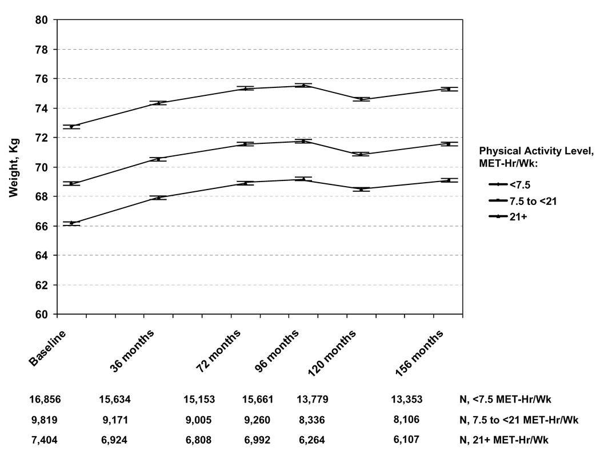

```{r setup, include=FALSE}
knitr::opts_chunk$set(echo = FALSE, warning = FALSE, message = FALSE)
```

```{r, include=FALSE}
options(tinytex.verbose = TRUE)
```


# Null hypothesis significance testing (NHST)

- NHST is the most common way of making *decisions* about **effects** within the sport sciences.
- NHST can be used to assess if e.g. groups are different or regression parameters are different than zero.
- NHST can be performed using the following steps:

1. Choose a *null*-hypothesis, e.g. there is no differences between groups $H_0:\mu_1 = \mu_2$, and a alternative hypothesis e.g. $H_1:\mu_1 - \mu_2 \neq 0$
2. Specify a **significance level**, usually 5% (or $\alpha=0.05$).
3. Perform an appropriate test, in the case of differences between means, a *t* test and calculate the $p$-value 
4. If the $p$-value is less than the stated $\alpha$-level we declare the result as statistically significant and reject $H_0$.


# NHST is a special flavour of hypothesis testing

- Two competing views on hypothesis testing were originally presented by Ronald A. Fisher on the one hand and Jerzy Neyman and Egon Pearson on the other hand.

\footnotesize
\begin{table}[]
\begin{tabular}{@{}ll@{}}
\toprule
Fisher                                                            & Neyman-Pearson                                                             \\ \midrule
1. State $H_0$                                                    & 1. State $H_0$ and $H_1$                                                   \\
2. Specify test statistic                                         & 2. Specify $\alpha$ (e.g. 5\%)                                             \\
3. Collect data, calculate \\ test statistic and $p$-value           & 3. Specify test statistics and critical value                              \\
4. Reject $H_0$ if $p$ is small                                   & 4. Collect data, calculate test statistic, determine $p$                \\
                                                                  & 5. Reject $H_0$ if favor of $H_1$ if $p < \alpha$
\end{tabular}
\end{table}
\normalsize


\scriptsize
Kline, R. B. (2013). *Beyond significance testing: Statistics reform in the behavioral sciences*, 2nd ed. Washington, DC, US, American Psychological Association
\normalsize


# The $p$-value

- The $p$-value is the probability of obtaining a value of a **test statistic** (t) as extreme as the one obtained or more extreme under the condition that the null-hypothesis is true:

$$p(t|H_0)$$

- We assume that the **null is true** and we calculate how often a results such as the one obtained would occur as a result of chance. However, using $\alpha = 0.05$ we simply declare *significant* when $p<\alpha$ (and accept that we will be wrong in 5% of repeated studies), **this is the Neyman-Person approach**, 

- The $\alpha$-level is the Type 1 error rate, the probability of rejecting $H_0$ when it is actually true.

# Interpreting $p$-values

- There are two distinct ways of looking at the $p$-value, one where the $p$-value is a pre-specified threshold for decision (Neyman-Pearson), and one where the $p$-value is thought of as a **meassure of strength of evidence** against the null-hypothesis (Fisher).
- It is common practice to combine the two approaches in analysis of scientific experiments. Examples:
        
* "There was not a significant difference between groups but the p-values suggested a trend towards ..."
* "The difference between group A and B was significant, but the difference between A and C was higly significant"

- According to the original frameworks, the mix (Fisher combined with Neyman-Pearson) leads to abuse of NHST

# Statistical power

- Neyman and Pearson extended Fishers hypothesis testing procedure with the concept of power.
- An alternative hypothesis can be stated for a specific value of e.g. a difference $H_1: \mu_1-\mu_2 = 5$
- Using this alternative hypothesis we can calculate the statistical power: The probability of **rejecting** $H_0$ if the alternative hypothesis is true. 
- The probability of failing to reject $H_0$ if $H_1$ is true is the Type 2 error rate ($\beta$).
- Statistical power is therefore: $1-\beta$.

# Errors in NHST

- There are two scenarios where we make mistakes, by rejecting $H_0$ when it is actually true and not rejecting $H_0$ when it is false.

\begin{table}[]
\begin{tabular}{lllll}
\cline{2-3}
\multicolumn{1}{l|}{}             & \multicolumn{1}{l|}{Accept $H_0$}     & \multicolumn{1}{l|}{Reject $H_0$}    &  &  \\ \cline{1-3}
\multicolumn{1}{|l|}{$H_0$ is true}  & \multicolumn{1}{l|}{Correct!}      & \multicolumn{1}{l|}{Type I error} &  &  \\ \cline{1-3}
\multicolumn{1}{|l|}{$H_0$ is false} & \multicolumn{1}{l|}{Type II error} & \multicolumn{1}{l|}{Correct!}      &  &  \\ \cline{1-3}
                                  &                                    &                                   &  & 
\end{tabular}
\end{table}

# Error rates in NHST

- We usually specify the level of Type I errors to 5%
- Another convention is to specify the power to 80%, this means that the risk of **failing to reject** $H_0$ when $H_0$ is **false** is 20%.
- These levels are chosen by tradition(!), but a well designed study is planned using well thought through Type I and II error rates.
- In the case of $\alpha = 0.05$ and $\beta=0.2$, Cohen (1988) pointed out that this can be thought of as Type I errors being a mistake four times more serious than Type II errors. ($\frac{0.20}{0.05} = 4$)
- Rates could be adjusted to represent the relative seriousness of respective errors.

# The $\alpha$-error and statistical power is related

```{r, fig.align='center', fig.dim = c(4,2.5)}
library(pwr); library(tidyverse)

results <- data.frame(sig.level = seq(from = 0.001, to = 0.3, by = 0.001), 
                      power = NA)


for(i in 1:nrow(results)) {
        
        pt <- pwr.t.test(n = 20, d = 0.5, 
                         sig.level = results[i,1], type = "two.sample", 
                         alternative = "two.sided")
        
        results[i,2] <- pt$power
       
}

results %>%
        ggplot(aes(sig.level, power)) + geom_line() + 
        xlab(expression(alpha)) + 
        ylab(expression(1-beta)) +
        theme_classic() + 
        annotate("text", x = 0.15, y = 0.35, label = "n = 20 \n effect-size = 0.5")
```

# Error rates in NHST, an example

- If a study tries to determine if a novel treatment with no known side-effects should be implemented, **failure to detect a difference** compared to placebo when **there is a difference** (Type II error) would be more serious than to detect a difference that is not true (Type I error).
- In this case error rates could be adjusted to reflect this, decrease possibility Type II errors by increasing the possibility of Type I errors.

# Power analysis in NHST

- When planning a study within human exercise physiology, we want to know *how many participants to recruit. *
- This is a question of **cost** as more participants means **more work**
- It is a question of **ethics** as more participants means that more people are subjected to risk/discomfort. 
- We aim to recruit as many participants as is necessary to answer our question.
- We state our $H_0$ and $H_1$ (according to the Neyman-Pearson tradition).
- The $H_1$ has a special function, this can be seen as the smallest meaningful difference between conditions under study, the difference we want to be able to detect.
- When we have specified $H_1$ we can perform power analysis and **sample size estimation**.

# Power analysis, an example

- We want to compare the muscle mass gains as a result of two resistance training protocols.
- A 1 kg difference in lean mass increases is considered a meaningful difference after 12 weeks of training.
- The standard deviation from previous studies is used to estimate the expected variation in responses to 12 weeks of resistance training.  
- We plan to perform our experiment with equal sized groups and assume they will have the same variation ($\sigma = 2.5$).
- To calculate the required sample size we first must calculate a standardized effect size, also known as Cohen's $d$. 
- We can standardize our "effect size" of 1 kg by dividing by the SD.
$$d = \frac{1}{2.5}= 0.4$$

# Effect sizes

- The effect size is the primary aim of an experiment, we wish to know the difference, correlation, regression coefficient, percentage change... 
- The effect size can be standardized (e.g. divided by the standard deviation or calculated as e.g. a correlation).


# Power analysis, an example cont.
- We must specify $\alpha$ and $1-\beta$ to calculate the required sample size, let's say that the Type I error is four times more serious than the Type II error, and that we would accept to be wrong in rejecting $H_0$ at a rate of 5%.

$$\alpha=0.05, \beta=0.2, d = 0.4$$

```{r}
power <- pwr.t.test(d = 0.4, power = 0.8,
                         sig.level = 0.05, type = "two.sample", 
                         alternative = "two.sided")


```

- Given these specifics we would require `r ceiling(power$n)` in each group to be able to show a meaningful difference with the power set to 80%.
- This is a **big study** what if we examine the smallest difference we can detect using a set sample size

# Mean difference between groups vs. number of participants per group

```{r, fig.align='center', fig.dim = c(4,2.5)}

results <- data.frame(n = seq(from =8, to = 100, by = 1), 
                      d = NA)


for(i in 1:nrow(results)) {
        
        pt <- pwr.t.test(n = results[i,1], power = 0.8, 
                         sig.level = 0.05, type = "two.sample", 
                         alternative = "two.sided")
        
        results[i,2] <- pt$d
        

}


results %>%
        mutate(kg = d*2.5) %>%
        ggplot(aes(n, kg)) + geom_line() + 
        xlab("Number of participants\nper group") +
        ylab("Mean difference between\n groups (kg)") + 
        theme_classic()

```

# Power analysis

Statistical power is influenced by:

- The $\alpha$ level
- The direction of the hypothesis (negative, positive or both ways different from $H_0$)
- Experimental design (within- or between-participants)
- The statistical test
- Reliability of test scores

# Power analysis in R

- The `pwr` package can be used to calculate sample size, power, effect sizes or $\alpha$-levels.
- The relationship between these values can be used to calculate one unknown. 
- We simply must "guess" values for some of the values using data from previous studies

\scriptsize

```{r, eval = FALSE, echo = TRUE}
pwr.t.test(power = 0.8, 
           d = 0.4,
           sig.level = 0.05, 
           type = "two.sample",
           alternative = "two.sided")
```

\normalsize

# Critique of NHST

- NHST with $p$-values tend to create an "either-or" situation, gives no answer about the size of an effect
- Test statistics are related to sample size, small effects can be detected using big sample sizes
- Built in to the NHST framework is the acceptance of a proportion of tests being false positive ($\alpha$), the likelihood of getting false positives increases with the number of tests.

# NHST and magnitude of an effect

- "The training group gained 3 kg in muscle mass (p<0.05)"

# Statistical significance and clinical significance

Large sample sizes can make small effect sizes statistically significant. Example, Lee, I-Min et al (2010):  

- Objective: To examine the association of different amounts of physical activity with long-term weight changes among women consuming a usual diet.

- Design: Prospective cohort study, following 34,079 healthy, US women (mean age, 54.2 years) from 1992–2007. At baseline, 36-, 72-, 96-, 120-, 144- and 156-months’ follow-up, women reported their physical activity and body weight.

- Results: Women gained a mean of 2.6 kg throughout the study. In multivariate analysis, compared with women expending $\geq$ 21 MET-hr/week, those expending 7.5-<21 and <7.5 MET-hr/week **gained 0.11 kg (SD=0.04; P=0.003) and 0.12 kg (SD=0.04; P=0.002)**, respectively, over a mean interval of 3 years.

# Results 

```{r, out.width = "80%", fig.align='center'}


```


\tiny
*Lee, I-Min et al. "Physical Activity and Weight Gain Prevention" JAMA: the journal of the American Medical Association 303.12 (2010): 1173–1179. PMC. Web. 24 Sept. 2018.
\normalsize

# Making the wrong decision 5% of the time

- Given that NHST accepts mistakes at a rate of $\alpha$, every $\frac{1}{\alpha}=20^{th}$ test result will be false. 
- The Neyman-Pearson approach is to only do NHST with an pre-specified $\alpha$-level
- One must also avoid making up hypotheses after the test.
- If you do multiple tests, family-wise corrections can be made, e.g. the Bonferroni correction:

$$\alpha_{Bonferroni}=\frac{\alpha}{n~tests}$$

- For statistical significance to be reached, the $\alpha_{Bonferroni}$ threshold must be reached.


# A complement or alternative to NHST: Estimation

- Instead of testing against a null-hypothesis, estimation aims at finding a point estimate of the parameter of interest
- Secondly we want to find an interval estimate of the parameter
- This can be done using confidence intervals.
- Confidence intervals provides an point-estimate together with a range of plausible values of the population parameter.

# Estimation, an example

```{r, fig.align = 'center', fig.dim = c(4,1.5)}
df <- data.frame(m = c(2, 1.8), error = c(1.9, 2.3), Study = c("A", "B"))
df %>%
        ggplot(aes(m , Study, fill = Study)) + 
        
        geom_errorbarh(aes(xmin = m-error, xmax = m+error), height = 0.2) +
        geom_point(size = 3, shape = 21) + 
        xlab("Effect") + ylab("Study")+
        annotate("text", x=1, y=1.3, label= paste("p-value", "==0.03"), parse = TRUE) +
        annotate("text", x=1, y=2.3, label= paste("p-value", "==0.13"), parse = TRUE) +
        theme_classic()
```

- What conclusions can be drawn from the two studies (using NHST vs. estimation)?

\tiny
Example from: Cumming, G. (2012). **Understanding the new statistics : effect sizes, confidence intervals, and meta-analysis**. New York, Routledge.
\normalsize

# Estimation

- In addition to giving a interval representing the precision of the estimate, the confidence interval can be used to assess the clinical importance of a study. 
- Are values inside the confidence interval large (or small) enough to care about in a clinical sense (e.g. weight gain study)
