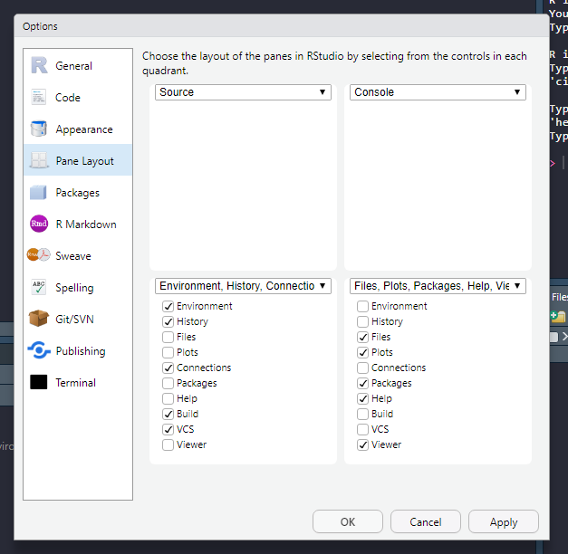

## Learning objectives

By the end of this session you will be able to answer these questions:

- What is R and RStudio?
- How can I interact with R?
- What is a reproducible computing?
- How do I maintain a reproducible workflow in R and RStudio?


## R and RStudio

You have already downloaded and installed both R and RStudio. R is a software used for scientific/statistical computing. If R is the engine, RStudio is the rest of the car. What does this mean?

When doing operations in R, you are actually writing interaction with R through RStudio. RStudio have some important components to help you interact with R.

### The source

The source is where you keep your code. When writing your code in a text-file, you can call it a script, this is essentially a computer program where you tell R what to do. It is executed from top to bottom. You can send one line of code, multiple lines or whole sections into R. In the image below, the source window is in the top left corner.

## Environment

The environment is where all your objects are located. Objects can be variables or data sets that you are working with. In RStudio the environment is listed under the environment tab (bottom left in the image).

Copy and run the code below.


```{r, eval = FALSE}

a <- c(1, 2, 4)

```

What happend in your environment?

## The console

Here you can directly interact with R. This is also where output from R is printed. In the image below, the console is in the top right corner.

## Files, plots, packages and help files

In RStudio files are accessible from the Files tab. When opening a project, the files tab shows the files in you root folder. 

Plots are displayed in the Plot tab. Packages are listed in the packages tab.

If you access the help files, these will be displayed in the help tab. 

In the image below all these tabs are in the bottom right corner.


## Customizing the apperance of RStudio

To access options for RStudio, go to Tools -> Global options


Under apperance you can customize the theme of RStudio, select something that is easy on the eye!


Under pane layout, you can set where you want your tabs, I like to have the source on the left, above the environment. This way you can have the source window at full vertical size and still look at plots and the console to the right.



## Reproducible computing

Computations are reproducible when you can show how they were performed. This is achieved by creating "programs" from where your analyses are done. In R, these programs are lines or R code stored in a text-file, either .R-files or .Rmd-files. .R-files are scripts only containing code and comments. A .Rmd-file is a special script combining text and computer code, when the Rmd-file is executed, it creates a report and outputs the results from the code.

This means that to work in a reproducible way, you need to script all your operations. 


Importantly, in RStudio you can shut down storing temporary objects in a environment that is relaunched on startup. What is the consequence of having such a situation?

To diasble this option, set save workspace to NEVER!


## On to the next session

Time for a break!

[Continue with the next session](./introduction_2.html)


