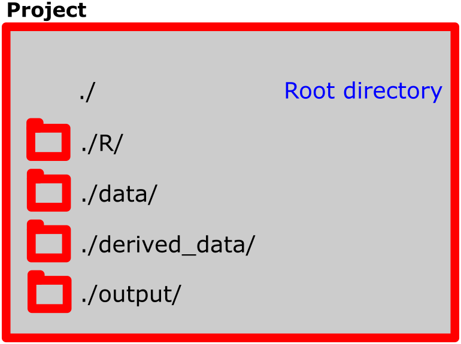

## Learning objectives

By the end of this session you will be able to answer these questions:

- What is a project?
- What data types are there?
- What types of "data containers" are there? 
- What is vectorized operations?
- What is a function?
- What is a package?
- How do you structure a script?


## Projects 
It is convenient to gather all your scripts, data files and output in one folder. This makes it easier to share your analyses and makes it easier to make it reproducible. When starting a new analysis, make sure you start a new project!
A project should be self-contained, meaning that all scripts should be able to run based on the information that is in the project folder. If your analyses dependens on something (e.g. a script) outside the project, your analyses are not reproducible unless you also share the external file. 

Data can be collected from external sources, but do this with a script!

To organize your project, think about it as a folder, containing several sub-folder.



The root folder is the uppermost level in the folder structure. In this folder you can have report files (R-markdown files). This is a good idea as when you compile them, thay will have the same folder structure as your project. 

The R folder contains scripts, all written to perform specific tasks (see below). The data folder contains data used in analyses. I like to have a derived_data-folder, here I gather data that has been created with scripts. An output folder can be used to gather reports and figures that you create. 

### Starting a project
Start a new project by clicking in the right upper corner ()


You will be asked what kind of project you want to start. A new directory will launch a new folder. Existing directory will let you select a folder where you want to have your project. Version control is very good to have, especially when collaborating or when you do big project. This lets you track changes that are made and store your scripts online. It requires [GitHub](www.github.com) or similar version control system. We will not cover it in this course, but I recommend interested students to discover it by yourself.


When you select "New directrory" you will be asked, dependning on your configuration, what type of project you want to start. Choose "New Project", this is generic and suited to our needs. 


Select a good name for your project (specific enough so you can easily find it). And choose the location where you want it on your local computer.


Done! When your are active in a project, RStudio will show you the name of the project in the upper right corner.


The Files tab will show an almost empty folder. The only file should be the project file. This file contains information about the project needed when you want to launch it again. You can also launch the project by double clicking it (this will start RStudio). If you click it from whitin RStudio, you will be able to control some settings. 

By now you should have set the .RData/workspace settings to facilitate reproducible workflow (see previous page). Do not save workspace on exit.

### Start coding!
The online book [Learning statistics with R](https://learningstatisticswithr.com/book) has an updated chapter about installing and setting up R ([Chapter 3](https://learningstatisticswithr.com/book/introR.html)). This chapter also goes through how commands are typed into R. 

When you have installed your copy of R and RStudio, start up RStuido and type the following in the consol window:

```{r, eval = FALSE}

x <- 2

z <- 4

x + z

```

These "commands" tells R to store the number 2 in an object that we name `x`. Then we store the number 4 in an object named `z` . Next we tell R to add these two together. If you enter each command followed by pressing enter in the console, R will return the sum of x and z which should be 6. 

The operations that you did above using the `<-` operator is called variable assignment. Read more about it in [section 3.4 of Learning statistics with R](https://learningstatisticswithr.com/book/introR.html#assign).

Before going any futher it can be usefull to know that you can save your code as R scripts. In RStudio, go to `File > New File > R Script`. The R script is a text-file where you can write code that can be sent to the console. To execute a line of code, have the cursor on the line you would like to run and press `Ctrl + Enter` on your keyboard. If you would want to run the whole script, either press `Source` in the top right corner of the Source window in RStudio or select all lines and pre `Ctrl + Enter`. R scripts can be saved, this makes for an opportunity to make reproducible analyses. We will talk more about this later. 

In the R script we can "comment out" lines of text using the `#` symbol. An R script with comments can look like this:

```{r, eval = FALSE}
# This line is a comment, the line below is code

x <- 34

# This line is a comment, in this script only x <- 34 will be evaluated.
```

### Types of data in R
R can store many types of data.

#### Scalars

**Scalars** are objects that can take only one value at a time. We have already worked with scalars when we assigned a single number to the objects we named `x` and `z` above. Scalars can also be `TRUE` or `FALSE`, these "are reserved words denoting logical constants in the R language"^[This is information from the R documentation, these can be accessed using the `?` symbol followed by a name of a function, e.g. `?logical` typed into the console] meaning that they have special meaning and cannot be used for assigning different values to. If we try, R returns an error message:

```{r, eval = FALSE}
# Trying to assign a value to TRUE
TRUE <- 3
```

```{r, echo = FALSE}
# Trying to assign a value to TRUE
try(TRUE <- 3)
```

The message says that the left-hand side of the assignment is invalid. `TRUE` is on the left-hand sign of the `<-` operator.

**Scalars** can also be character strings, this means text. We can thus store text in an object like this:

```{r}
# Store text in an object, named text
text <- "This is text, more specifically a character string"
```

When asking R to return (or print) what is stored in the object `text` we will ge this in the console:

```{r}
text
```

#### Vectors
A **vector** is an object containing multiple entries of data, or multiple scalars. These can be of different types; `numeric`, `character` or `logical`. A vector can be created by storing data in an object using the `c()`function. The `c()` function *combines* data into a vector.

```{r}
numeric_vector <- c(1, 4, 6, 8) # A numeric vector
logical_vector <- c(TRUE, FALSE, TRUE, TRUE) # A logical vector
character_vector <- c("a", "character", "vector", "!")
```

We can access specific parts of the vector by specifying the place in the vector. For example if we want to print the word "character" from the object `character_vector` we access it by `character_vector[2]`

```{r}
# Access the second element of the vector
character_vector[2]
```

We can name the elements of the vector and access them by calling their names

```{r}
# Check the names (Should be NULL, nothing there)
names(character_vector)

# Name the elements using another vector
names(character_vector) <- c("the first name", "the second name", "the third name", "the fourth name")

# Access the second element
character_vector["the second name"]
```

This is sometimes usefull, but more importantly, it shows how you can acces data from a vector.

One of the nice things about the R language is the mathematical operations can be done on vectors. If we multiply the numeric vector with 2, all element of the vector will be multiplied with 2.

```{r, eval = FALSE}
numeric_vector * 2
```

This command does the following:

|vector|operator|value|
|-----:|:------:|:----|
|1     | *      | 2   |
|4     | *      | 2   |
|6     | *      | 2   |
|8     | *      | 2   |

If the numeric vector is multiplied with another vector of the same length, the operation is done row-wise. 

```{r, eval = FALSE}
numeric_vector * c(2, 1, 2, 3)
```

|vector 1|operator|vector 2|
|-------:|:------:|:-------|
|1       | *      | 2      |
|4       | *      | 1      |
|6       | *      | 2      |
|8       | *      | 3      |

Note that if vectors are not the same length (or a multiple of shorter object length), R will give you a warning.

```{r, eval = FALSE}
numeric_vector * c(2, 1, 4)
```

```{r, echo = FALSE}
try(numeric_vector * c(2, 1, 4))
```

A vector of length 4 can be multiplied with a vector length 2 as the shorter vector can be used two times over the longer vector.

Character vector can not be used in mathematical operations, try it out, what do the error message say? What does it mean?

Logical vectors can be "coerced" to numeric vector. But why do we get the results below, how do R interet the logical vector?

```{r}
numeric_vector * logical_vector
```

### Data frame
We will work alot with data frames. These are tables of data with rows and columns. A data frame can be created using the `data.frame()`

```{r}
# Create my data frame
my_df <- data.frame(Variable1 = c(1,2,3,4), Variable2 = c(5, 5, 5, 5), Variable3 = c("one", "two", "three", "four"))
```

The data frame can combine different types of data into one table. The data frame can be viewed in the console by calling it, we can also access different rows and columns by specifying it when calling it e.g. using the logic `my_df[row, column]`

```{r}
# The whole data frame
my_df

# The last row
my_df[4, ]
# The firts column
my_df[,1]
# The first row, second column
my_df[1,2]
```

We can also access and create new columns in a data frame by using the `$` operator. We can use variables in the data frame to create these new variables.

```{r}
my_df$Variable4 <- my_df$Variable1 + my_df$Variable2

my_df
```

Later we will learn different ways of manipulating data frames that will turn out to be a bit more convinient. 

#### Matrix
A martrix is a type of table, similar to a data frame, but all element must be of the same type e.g. numeric. 

#### Lists
Lists are objects containing other objects. We can combine objects in a list, this is sometimes usefull for storage of data. We can name the objects in the list when listing them or by using the `names()` function. This is nice, becauese we can access it by using the `$` operator.

```{r}
# Store objects in a list
my_list <- list(my.vector = numeric_vector, 
             my.dataframe = my_df)


my_list$my.vector
```

#### Functions
R can store data and functions. Functions are usuallly used to take some input, do something and return an output. R contains alot of functions as this is the basis of how we work with data. There is no need to write functions, these are already written by others and can be used by you to analyze data or make figures. However, it can be useful to know how a function works.

A quick look! We will create a function that calculates the mean of a vector. This function already exists, it is called by the `mean()` command.

We can use our numeric vector and calculate its mean

```{r}
mean(numeric_vector)
```

Lets create a function that does the same:

```{r}
# Define a name of the function and start the code block creating the function 
# Inside function(), the arguments of the function is defined
my_mean <- function(data = data){  # The curly brackts tells R that this code is written over multiple lines (group statement)
        
        n <- length(data) # Length is a function that gives the number of entries in a vector
        
        sum <- sum(data) # Sum calculates the sum of a vector
        
        my_mean <- sum/n # Sum over number of entries
        
        return(my_mean) # return is a function (used in functions) that tells R to print a specified value 
        
        }

# See if it works
my_mean(numeric_vector)
```

Our own function returns the same number as the built in function. Great success!

All functions (included or self-made) are used in the same form as for example `mean()`, inside parentheses you write your `arguments` these can be data or "settings" for the function. You will be familiar with this way of working with functions.

### Packages
Functions are created with a specialized task. Functions are collected in **packages** made to do a series of tasks, usually within a specific area. In this course we will use different packages, for example [dplyr](https://dplyr.tidyverse.org/), [tidyr](https://tidyr.tidyverse.org/) and [ggplot2](https://ggplot2.tidyverse.org/). These have to be installed through R/RStudio.

To install a package, you use the `install.packages()` function. You only need to do this once.

```{r, eval = FALSE}
install.packages("dplyr")
```

To use a package, you have to load it into your environment. Use the `library()` function to load a package.

```{r, eval = FALSE}
library("dplyr")
```

## Looking for help
In this course you will trained to do and communicate analyses of data. Often, an analysis require that you do stuff that you have never done before with software you have never used. This means that you need to develope your problem-solving skills. A good thing about using the R ecosystem is that there is a lot of help online. The key is to know what to look for! 

When you google a more general concept, like "importing data into R", there are alot of websites with guides on how to do that. For example [Quick-R](https://www.statmethods.net/input/importingdata.html) has really good step-by-step instructions.

When you google a specific problem like "how do i interpret results from lm in r", you will usually find results from StackExchange/Cross validate ([for example this](https://stats.stackexchange.com/questions/59250/how-to-interpret-the-output-of-the-summary-method-for-an-lm-object-in-r)). These are forum posts answered by very knowledge people. Often multiple answers are given to forum questions, the best answer gets more attention so it is easy to find.

There are many blogposts, websites and other resources that describe specific analyses. Learn how to read them and you will increase your chances of solving your analysis tasks.

Inside R, you always have the R documentation. If you are interested in a specific function, for example `lm()`, type `?lm` in your console and you will access the help files.

## The structure of a script
R scripts can be thought of as small programs. They are executed from top to bottom. This means that you need to structure them in a certain way. 

Start by loading any packages that you need for your analysis. Then you can define functions (this is a bit premature, we will cover it later). Then you write the code that does what you intend with the script and last you may save your results.  The order is simply because you probably need the packages to be loaded to use functions from them. To save results you must first create them. It is a natural order. 

Be sure to comment what you do! If you use alot of comment it will be easier to catch up where you stopped last time. 


Start a new script trough the File menu. A simple script with lots of comments can look like this


```{r eval = FALSE}
# My first script

# Purpose: load some data and make a plot


### Load packages
library(dplyr) # needed for data manipulation
library(ggplot2) # needed for making figures


### Load data
data("mtcars") # mtcars is a dataset that exists in R (for examples)

fig <- mtcars %>%
        mutate(car = rownames(.),
               lpkm =  2.35214583 / mpg * 10) %>%  # Converts miles per gallon to litre per 10 km 
        ggplot(aes(hp, lpkm, label = car)) + geom_label() # plots horsepower against litre per 10 km 
        

ggsave("./output/figure1.png", plot = fig) # Saves figure in output
```

#### Resources
The above is not at all a complete introduction to data types, functions or usage. Below are some usefull resources to have at hand when you discover R:

* [Quick R](https://www.statmethods.net/index.html) contains several tutorials, including [Data types](https://www.statmethods.net/input/datatypes.html) and [creating new variables](https://www.statmethods.net/management/variables.html).
* [Learning statistics with R](https://learningstatisticswithr.com/book/) Chapter 3 is a good introduction to R.


